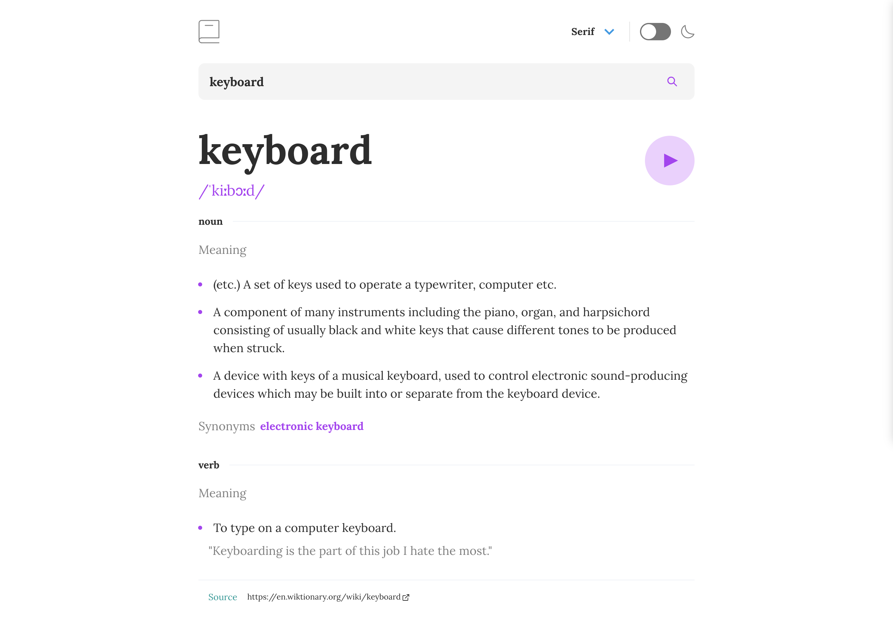

# Frontend Mentor - Dictionary web app

This is a solution to the [Dictionary web app challenge on Frontend Mentor](https://www.frontendmentor.io/challenges/dictionary-web-app-h5wwnyuKFL).

## Overview

### The challenge

Users should be able to:

- Search for words using the input field
- See the Free Dictionary API's response for the searched word
- See a form validation message when trying to submit a blank form
- Play the audio file for a word when it's available
- Switch between serif, sans serif, and monospace fonts
- Switch between light and dark themes
- View the optimal layout for the interface depending on their device's screen size
- See hover and focus states for all interactive elements on the page

### Screenshot

### Links

- Solution URL: [Github](https://github.com/Sana-Shabeel/calculator-app)
- Live Site URL: [netlify](https://ab-calculator-app.netlify.app/)

## My process

### Built with

- CSS Flexbox
- [React](https://reactjs.org/) - JS library
- [Typescript](https://www.typescriptlang.org/) - Typescript
- [Chakra UI](https://chakra-ui.com/) - For styles
